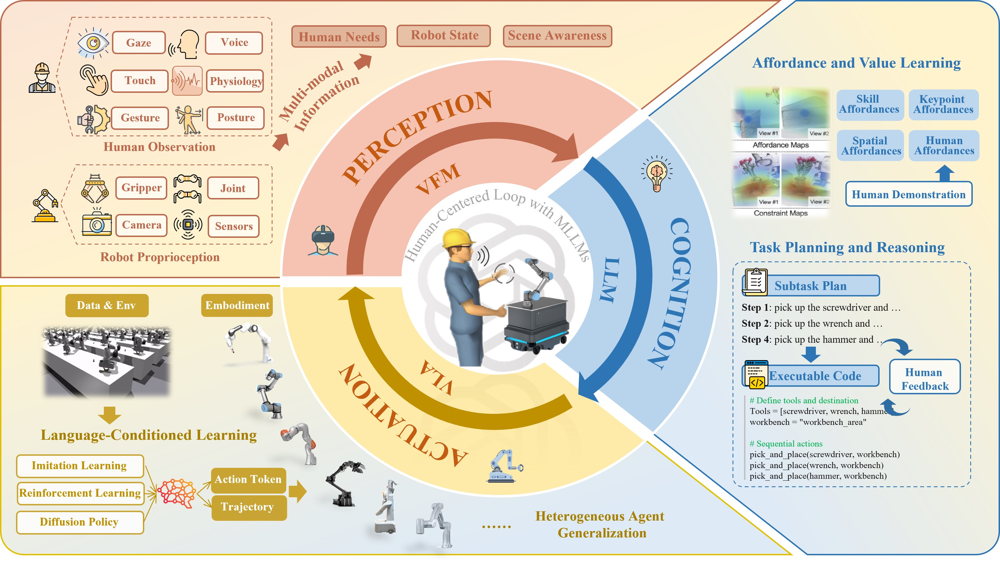
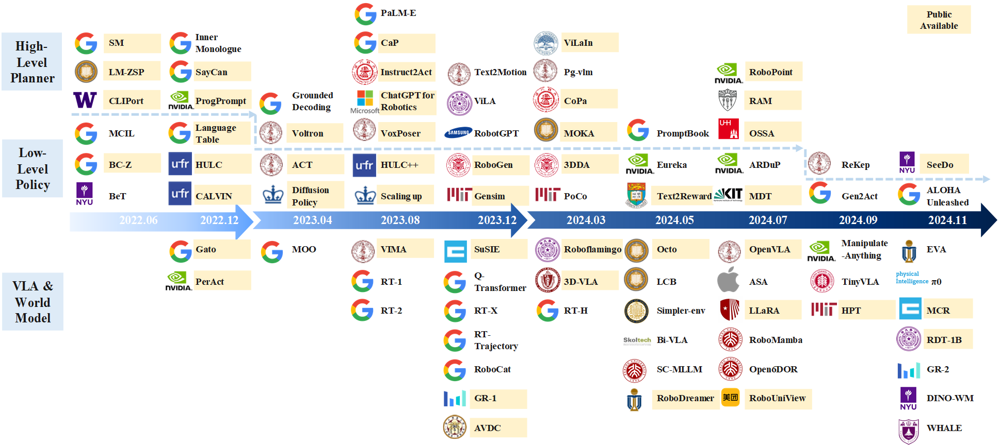
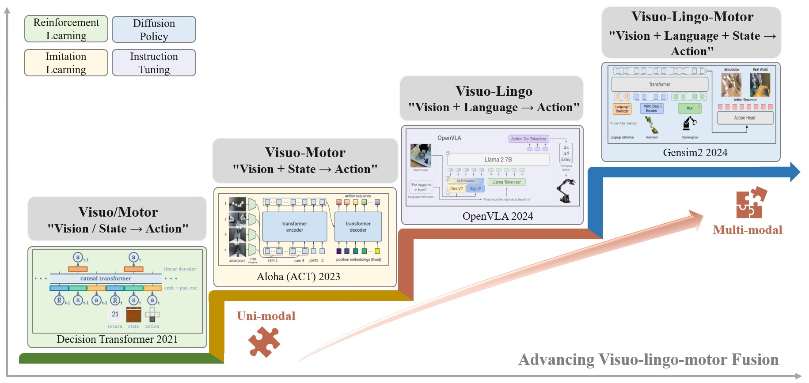
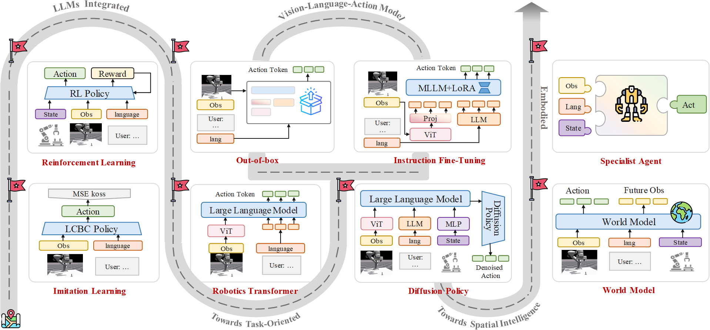
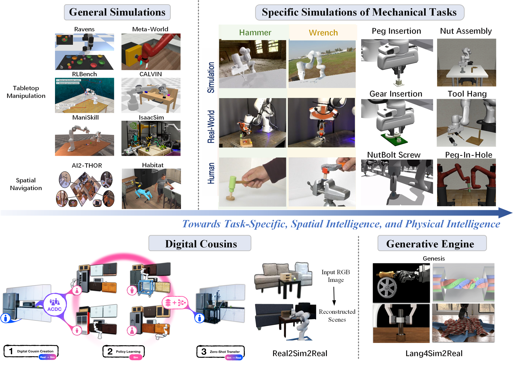

# 🚀 Empowering Natural Human-Robot Collaboration through Multimodal Language Models and Spatial Intelligence

**📌 Title**: *Empowering Natural Human-Robot Collaboration through Multimodal Language Models and Spatial Intelligence: Pathways and Perspectives*  
**🧠 Authors**: Duidi Wu, Pai Zheng, Qianyou Zhao, Shuo Zhang, Jin Qi*, Jie Hu*, Guo-Niu Zhu, Lihui Wang  
**🏫 Affiliations**: SJTU, PolyU, FDU, KTH  
**📄 [PDF](https://doi.org/10.1016/j.rcim.2025.103064)**  
**📝 Journal**: Robotics and Computer-Integrated Manufacturing [RCIM](https://www.sciencedirect.com/journal/robotics-and-computer-integrated-manufacturing)  
**📮 Contact**: [wu_duidi@sjtu.edu.cn](mailto:wu_duidi@sjtu.edu.cn)

---

## 🌟 Overview

This is the **first systematic review** that integrates:

- 🤝 Human-Robot Collaboration (HRC)  
- 🧠 Embodied Intelligence  
- 🌐 Multimodal Large Language Models (MLLMs)  
- 🗺️ Spatial Intelligence  

We explore how MLLMs + Embodiment can *empower robots to see, think, and act like humans* in open, dynamic environments — enabling seamless and proactive HRC.


---

## 🔍 Motivation

> **Why now?**  
Industry 5.0 calls for *human-centric smart manufacturing*. With the rise of MLLMs (like GPT-4V, Gemini, LLaVA), we have a unique opportunity to:
- Bridge the gap between human intent and robot execution.
- Enable spatially-aware, low-cost, multi-skill learning.
- Move beyond “cooperation” to *collaboration and coevolution*.


## ❓ Research Questions (RQs)

1. **RQ1**: How can MLLMs and embodiment improve seamless HRC?  
2. **RQ2**: How can spatial skills be trained efficiently?  
3. **RQ3**: What are the remaining challenges and future trends?

---

## 🌈 Highlights

- 📚 Over **200+ recent works** reviewed
- 🧩 Unified perspective for **HRC × Embodied AI × Spatial Intelligence**
- 🚀 Open challenges and *design pathways* for future human-centered systems

---


## 🧭 Content Roadmap




### 🔁 1. Perception–Cognition–Actuation Loop
- Visual + language + motor signals for complete situational awareness.
- From human intention recognition → task reasoning → physical execution.


#### 📊 1.1 Robots Affordance and Value Learning

| Category               | Method     | VFM                 | LLM/VLM        | Benchmark/Data        | Tasks                                | Links                                                                 |
|------------------------|------------|---------------------|------------|------------------------|---------------------------------------|---------------------------------------------------------------------|
| **Skill Affordance**   | CoPa       | Owl-ViT, SAM        | GPT-4V     | VoxPoser              | Everyday manipulation tasks          | [📄 Paper](https://arxiv.org/html/2403.08248v1) [💻 Code](https://copa-2024.github.io/) |
|                        | CLIPort    | Transporter         | CLIP       | Ravens                | Language-conditioned tasks           | [📄 Paper](https://arxiv.org/abs/2109.12098) [💻 Code](https://github.com/cliport/cliport) |
|                        | SayCan     | -                   | 540B PaLM  | Everyday Robots       | Long-horizon tasks                   | [📄 Paper](https://say-can.github.io/assets/palm_saycan.pdf) [💻 Code](https://say-can.github.io/) |
|                        | Voltron    | ViT                 | DistilBERT | Franka Kitchen        | 5 robotics applications              | [📄 Paper](https://www.roboticsproceedings.org/rss19/p032.pdf) [💻 Code](https://sites.google.com/view/voltron-robotics) |
| **Keypoint Affordance**| MOKA       | GroundedSAM         | GPT-4V     | Octo, VoxPoser        | Table-top manipulation, unseen objects | [📄 Paper](https://arxiv.org/html/2403.03174v2) [💻 Code](https://moka-manipulation.github.io/) |
|                        | ReKep      | DINOv2, SAM         | GPT-4o     | VoxPoser              | In-the-wild bimanual manipulation     | [📄 Paper](https://rekep-robot.github.io/rekep.pdf) [💻 Code](https://rekep-robot.github.io/) |
|                        | KALIE      |              | CogVLM,GPT-4V     | MOKA, VoxPoser        | Diverse unseen objects               | [📄 Paper](https://arxiv.org/pdf/2409.14066) [💻 Code](https://kalie-vlm.github.io/) |
| **Spatial Affordance** | VoxPoser   | OWL-ViT, SAM        | GPT-4      | RLBench               | Manipulation tasks                   | [📄 Paper](https://arxiv.org/abs/2307.05973) [💻 Code](https://voxposer.github.io/) |
|                        | RAM        | DINOv2 / CLIP       | Text-embedding-3,GPT-4V     | DROID                 | 3D contact planning                  | [📄 Paper](https://arxiv.org/html/2407.04689v1) [💻 Code](https://yuxuank.com/RAM/) |
|                        | RoboPoint  | CLIP, ViT-L/14      | Vicuna-13B | WHERE2PLACE           | Language-conditioned 3D actions      | [📄 Paper](https://arxiv.org/pdf/2406.10721) [💻 Code](https://robo-point.github.io/) |
| **Human Affordance**   | HRP        | DINO, CLIP          | -          | Ego4D                 | Human-hand-object interaction        | [📄 Paper](https://hrp-robot.github.io/hrp.pdf) [💻 Code](https://hrp-robot.github.io) |
|                        | HULC++     | -                   | GPT-3, MiniLM-L3-v2      | CALVIN                | Long-horizon manipulation            | [📄 Paper](https://arxiv.org/pdf/2210.01911) [💻 Code](http://hulc2.cs.uni-freiburg.de/) |

#### 📊 1.2 High-level Step-by-step Task Planning and Executable Code Generation 

| Category            | Method         | VFM           | LLM/VLM               | Benchmark         | Robot          | Tasks                             | Links                                                                 |
|---------------------|----------------|---------------|------------------------|-------------------|----------------|------------------------------------|---------------------------------------------------------------------|
| **Subtask Planning**| PaLM-E         | -             | PaLM                  | Language-Table    | Everyday Robot | Visually-grounded dialogue         | [📄 Paper](https://arxiv.org/abs/2303.03378) [💻 Code](https://palm-e.github.io/) |
|                     | Pg-vlm         | OWL-ViT       | GPT-4, PG-InstructBLIP| PHYSOBJECTS       | Franka Panda   | Table-top manipulation             | [📄 Paper](https://arxiv.org/abs/2309.02561) [💻 Code](https://iliad.stanford.edu/pg-vlm/) |
|                     | ViLA           | OWL-ViT       | Llama2-70B, GPT-4V    | Ravens            | Franka Panda   | Long-horizon planning              | [📄 Paper](https://arxiv.org/abs/2402.13918) [💻 Code](https://github.com/vila-group/ViLA) |
|                     | SayCan         | ViLD          | 540B PaLM             | Everyday Robots   | Everyday Robot | Long-horizon tasks                 | [📄 Paper](https://say-can.github.io/assets/palm_saycan.pdf) [💻 Code](https://say-can.github.io/) |
|                     | GD             | OWL-ViT       | InstructGPT, PaLM     | Ravens, CLIPort   | Everyday Robot | Rearrangement, mobile manipulation | [📄 Paper](https://arxiv.org/abs/2303.03836) [💻 Code](https://github.com/google-research/google-research/tree/master/generative_playground) |
|                     | Text2Motion    | -             | Text-davinci-003      | TableEnv          | -              | Long-horizon manipulation          | [📄 Paper](https://arxiv.org/abs/2303.12153) [💻 Code](https://sites.google.com/stanford.edu/text2motion) |
| **Code Generation** | Instruct2Act   | SAM           | Text-davinci-003      | VIMABench         | -              | Manipulation & reasoning           | [📄 Paper](https://arxiv.org/abs/2305.11176) [💻 Code](https://github.com/OpenGVLab/Instruct2Act) |
|                     | Inner Monologue| MDETR         | InstructGPT           | Ravens, CLIPort   | UR5e, ERobot   | Mobile rearrangement               | [📄 Paper](https://arxiv.org/abs/2207.05608) [💻 Code](https://innermonologue.github.io/) |
|                     | CaP            | ViLD, MDETR   | GPT-3Codex            | HumanEval         | UR5e           | Table-top & mobile manipulation    | [📄 Paper](https://arxiv.org/abs/2209.07753) [💻 Code](https://code-as-policies.github.io/) |
|                     | ProgPrompt     | ViLD          | GPT-3                 | Virtual Home      | Panda          | Household table-top tasks          | [📄 Paper](https://arxiv.org/abs/2209.11302) [💻 Code](https://progprompt.github.io/) |


#### 📊 1.3 Robots Learning from Demonstration

| Model         | Structure                | Problem                  | Benchmark     | Input                       | Output                        | Links                                                                 |
|---------------|--------------------------|---------------------------|---------------|-----------------------------|-------------------------------|---------------------------------------------------------------------|
| SeeDo         | SAM2 + GPT-4o            | Code Generation           | CaP           | Human demo videos           | Executable code               | [📄 Paper](https://arxiv.org/pdf/2410.08792) [💻 Code](https://github.com/ai4ce/SeeDo) |
| OKAMI         | GPT-4V + SLAHMR          | Humanoid manipulation     | ORION         | Human video                 | Manipulation policy           | [📄 Paper](https://arxiv.org/pdf/2410.11792) [💻 Code](https://ut-austin-rpl.github.io/OKAMI/) |
| R3M           | ResNet50 + DistilBERT    | Visual Representation     | Ego4D         | Image, proprioception       | Action vector                 | [📄 Paper](https://arxiv.org/abs/2203.12601) [💻 Code](https://github.com/facebookresearch/r3m) |
| R+X           | DINO + Gemini            | Skill retrieval           | R3M           | RGB-D observation           | 6-DoF action                  | [📄 Paper](https://arxiv.org/abs/2407.12957) [💻 Code](https://www.robot-learning.uk/r-plus-x) |
| RT-Trajectory | PaLM-E                   | Trajectory generalization | RT-1          | Drawings, videos            | Trajectory tokens             | [📄 Paper](https://arxiv.org/abs/2311.01977) [💻 Code](https://rt-trajectory.github.io/) |
| Gen2Act       | Gemini + VideoPoet       | Behavior cloning          | Vid2robot     | Instruction, observation    | Trajectory                    | [📄 Paper](https://arxiv.org/abs/2409.16283) [💻 Code](https://homangab.github.io/gen2act/) |
| EgoMimic      | ACT-based                | End-to-end imitation      | ACT           | Hand pose, proprioception   | SE(3) pose prediction         | [📄 Paper](https://arxiv.org/abs/2410.24221) [💻 Code](https://egomimic.github.io/) |


#### 📊 1.4 Robots Learning from Demonstration

| Method         | Policy Type     | Input State                      | Action Output         | Core Structure         | Links                                                                 |
|----------------|------------------|----------------------------------|------------------------|-------------------------|---------------------------------------------------------------------|
| PlayLMP        | GCBC             | Observation, proprioception      | 8-DoF action           | Seq2Seq CVAE            | [📄 Paper](https://arxiv.org/abs/1903.01973) [💻 Code](https://learning-from-play.github.io/) |
| MCIL           | GCBC             | Observation + instruction        | 8-DoF action           | TransferLangLfP         | [📄 Paper](https://arxiv.org/abs/2005.07648) [💻 Code](https://language-play.github.io/) |
| BC-Z           | End-to-end BC    | Image + task embedding           | 7-DoF action           | ResNet18 + FiLM + FC    | [📄 Paper](https://arxiv.org/abs/2202.02005) [💻 Code](https://sites.google.com/view/bc-z/home) |
| Language Table | LCBC             | Language instruction             | 2D point               | LAVA                    | [📄 Paper](https://arxiv.org/abs/2210.06407) [💻 Code](https://interactive-language.github.io/) |
| CALVIN         | LH-MTLC          | Multi-modal input                | Cartesian or joint     | Seq2Seq CVAE            | [📄 Paper](https://arxiv.org/abs/2112.03227) [💻 Code](http://calvin.cs.uni-freiburg.de/) |
| HULC           | LCBC             | Static image + language          | 7-DoF action           | Seq2Seq CVAE            | [📄 Paper](https://arxiv.org/abs/2204.06252) [💻 Code](http://hulc.cs.uni-freiburg.de/) |
| HULC++         | LCBC             | Static image + language          | 7-DoF action           | HULC + VAPO             | [📄 Paper](https://arxiv.org/pdf/2210.01911) [💻 Code](http://hulc2.cs.uni-freiburg.de/) |

#### 📊 1.5 Language-Enhanced Reinforcement Learning
| Method         | Policy Type     | Challenge                  | MLLM               | Role                    | Environment        | Links                                                                 |
|----------------|------------------|----------------------------|--------------------|--------------------------|---------------------|---------------------------------------------------------------------|
| Di Palo        | BC               | Sparse-reward              | FLAN-T5, CLIP      | Subgoal generation       | MuJoCo              | [📄 Paper](https://arxiv.org/abs/2307.09668) [💻 Code](#) |
| L2R            | MJPC             | Reward optimization        | GPT-4              | Reward function design   | MuJoCo              | [📄 Paper](https://arxiv.org/abs/2306.08647) [💻 Code](https://language-to-reward.github.io/) |
| VLM-RM         | DQN, SAC         | Zero-shot rewards          | CLIP               | Reward computation       | -                   | [📄 Paper](https://arxiv.org/abs/2310.12921) [💻 Code](https://sites.google.com/view/vlm-rm) |
| Song et al.    | PPO              | Self-refinement            | GPT-4              | Reward designer          | Isaac Sim           | [📄 Paper](https://arxiv.org/abs/2309.06687) [💻 Code](#) |
| Eureka         | PPO              | Human-level reward         | GPT-4              | Zero-shot reward         | Isaac Gym           | [📄 Paper](https://arxiv.org/abs/2310.12931) [💻 Code](https://eureka-research.github.io/) |
| LIV            | BC               | Goal-conditioned reward    | CLIP               | Multimodal value learning| MetaWorld           | [📄 Paper](https://arxiv.org/abs/2306.00958) [💻 Code](https://penn-pal-lab.github.io/LIV/) |


#### 📊 1.6 Language-Guided Diffusion Policies

| Model           | Structure                    | Problem                    | Input                     | Output                  | Robot         | Links                                                                                           |
|-----------------|------------------------------|-----------------------------|----------------------------|--------------------------|---------------|------------------------------------------------------------------------------------------------|
| Diffusion Policy | DDPM                         | Action generation           | Observation, proprioception| Action sequence          | UR5, Panda    | [📄 Paper](https://arxiv.org/abs/2303.04137) [💻 Code](https://diffusion-policy.cs.columbia.edu/) |
| 3DDA            | CLIP + 3D Diffuser           | 3D conditional planning     | Instruction + 3D scene     | Trajectory               | Franka        | [📄 Paper](https://arxiv.org/abs/2402.10885) [💻 Code](https://3d-diffuser-actor.github.io/)            |
| PoCo            | Diffusion Policy             | Heterogeneous policy        | RGB, pointcloud, language  | Trajectory               | Franka        | [📄 Paper](https://arxiv.org/abs/2402.02511) [💻 Code](https://liruiw.github.io/policycomp/)  |
| MDT             | CLIP + Voltron + Perceiver   | Core diffusion policy       | Observation + goal         | Action chunk             | Franka        | [📄 Paper](https://arxiv.org/abs/2407.05996) [💻 Code](https://intuitive-robots.github.io/mdt_policy/)    |
| Octo            | T5-base                      | Action chunk diffusion      | Obs + instruction          | Action chunk             | 9 robots      | [📄 Paper](https://arxiv.org/abs/2405.12213) [💻 Code](https://octo-models.github.io/)          |
| RDT-1B          | SigLIP + T5-XXL              | Scaled policy learning      | Visuo-lingo-motor data     | Denoised action chunk    | ALOHA robot   | [📄 Paper](https://arxiv.org/abs/2410.07864) [💻 Code](https://rdt-robotics.github.io/rdt-robotics/)           |
| 𝜋0          | PaliGemma VLM              | Diffusion policy    | Visuo-lingo-motor data     | Consecutive action chunk   | 7robots  | [📄 Paper](https://arxiv.org/abs/2410.24164) [💻 Code](https://www.physicalintelligence.company/blog/pi0)           |


### 🚀 2. Advancing Visuo-lingo-motor Fusion


---
- **Visuo/Motor**:  
  *"vision → action"* : $\pi(a| o)$ — robots output actions based on visual observation, as in [Diffusion policy](https://arxiv.org/abs/2303.04137).  
  *"state → action"* : $\pi(a| s)$ — for example,  [Decision Transformer](https://arxiv.org/abs/2106.01345) uses states to predict actions at the next time step.

- **Visuo-Motor**:  
  *"vision + state → action"* — observations and proprioceptions (e.g., joint positions) are integrated to output actions, such as  [ACT](https://arxiv.org/abs/2304.13705).

- **Visuo-Lingo**:  
  *"vision + language → action"* : $\pi(a| o,l)$ — also known as **language-conditioned visuomotor policy**, this paradigm predicts actions from observations and instructions.  
  Most VLAs follow this structure, such as 
  [openvla](https://arxiv.org/abs/2406.09246), [RT-2](https://robotics-transformer2.github.io/assets/rt2.pdf).

- **Visuo-Lingo-Motor**:  
  *"vision + state + language → action"* : $\pi(a| s,o,l)$ — robots holistically integrate visual, linguistic, and physical inputs, such as in  [𝜋0 ](https://arxiv.org/abs/2410.24164), [Octo](https://arxiv.org/abs/2405.12213), [gensim2](https://arxiv.org/abs/2410.03645).


### 🧠 3. Pathway for General Intelligence
- This pathway toward human-like intelligence spans from imitation and reinforcement learning, to out-of-the-box or instruction-tuned vision-language action models (VLAs), and further to diffusion policy and world model, paving the way toward general embodied intelligence.



| Category                  | Method        | VFM / LLM / VLM                      | Benchmark/Data       | Input / Tasks / Output                              | Links                                       |
|---------------------------|---------------|------------------------------------|----------------------|----------------------------------------------------|---------------------------------------------|
| **Robotic Transformers (RT)** | RT-1          | FiLM EfficientNet                  | RT-1                 | Observation and instructions; Output: 11D actions  | [📄 Paper](https://www.roboticsproceedings.org/rss19/p025.pdf) [💻 Code](https://robotics-transformer.github.io) |
|                           | RT-2          | ViT, PaLI-E, PaLI-X                | RT-1                 | Observation and instructions; Output: 7D action tokens | [📄 Paper](https://robotics-transformer2.github.io/assets/rt2.pdf) [💻 Code](https://robotics-transformer.github.io)                   |
|                           | MOO           | Owl-ViT, FiLM EfficientNet         | RT-1                 | Images and language instructions; Output: 7D action tokens | [📄 Paper](https://arxiv.org/abs/2303.00905) [💻 Code](https://robot-moo.github.io/) |
|                           | Q-Transformer | FiLM EfficientNet                  | Manual dataset       | Observation and instructions; Output: Q-value of action | [📄 Paper](https://arxiv.org/abs/2309.10150) [💻 Code](https://qtransformer.github.io/)  |
|                           | RT-H          | ViT, PaLI-X                       | Kitchen dataset      | Image and task tokens, action query; Output: Action token | [📄 Paper](https://arxiv.org/abs/2403.01823) [💻 Code](https://rt-hierarchy.github.io/)  |
| **Vision-Language-Action (VLA)** | Bi-VLA        | Qwen-VL                           | -                    | Observation and user request; Output: Executable code | [📄 Paper](https://arxiv.org/abs/2405.06039) [💻 Code](#)                   |
|                           | OpenVLA       | SigLIP, DinoV2, Prismatic-7B      | OXE, BridgeData V2    | Observation and instructions; Output: 7D action tokens | [📄 Paper](https://arxiv.org/abs/2406.09246) [💻 Code](https://openvla.github.io/)                   |
|                           | TinyVLA       | Pythia                           | MetaWorld             | Observation and instructions; Output: 6D action       | [📄 Paper](https://arxiv.org/abs/2409.12514) [💻 Code](https://tiny-vla.github.io/)                   |
|                           | LLaRA        | GPT-4, LLaVA-1.5-7B               | VIMA, inBC, D-inBC    | Observation, task, and previous actions; Output: Textual actions | [📄 Paper](https://arxiv.org/abs/2406.20095) [💻 Code](https://github.com/LostXine/LLaRA)                   |
|                           | RoboPoint    | CLIP, Vicuna-v1.5                 | WHERE2PLACE           | Observation and instructions; Output: 3D action points | [📄 Paper](https://arxiv.org/pdf/2406.10721) [💻 Code](https://robo-point.github.io/)                   |
|                           | Roboflamingo | LLaMA, GPT-4, OpenFlamingo         | CALVIN                | Task and 2 camera views; Output: 7D action tokens     | [📄 Paper](https://arxiv.org/abs/2311.01378) [💻 Code](https://roboflamingo.github.io/) |
|                           | RoboUniView  | ViT, UVFormer                    | CALVIN                | Task and multi-camera views; Output: 7D action tokens | [📄 Paper](https://arxiv.org/abs/2406.18977) [💻 Code](https://github.com/liufanfanlff/RoboUniview)                   |
|                           | RoboMamba   | CLIP, Mamba                      | LLaVA 1.5, RoboVQA    | Image and language question; Output: 6-DoF EEF poses   | [📄 Paper](https://arxiv.org/abs/2406.04339) [💻 Code](https://sites.google.com/view/robomamba-web)                   |
| **Out-of-box Usage**         | CoPa          | Owl-ViT, SAM, GPT-4V              | Real-world data       | Observation and instructions; Output: 6-DoF end-effector poses | [📄 Paper](https://arxiv.org/html/2403.08248v1) [💻 Code](https://copa-2024.github.io/) |
|                           | VoxPoser      | Owl-ViT, SAM, GPT-4              | RLBench               | Observation and instructions; Output: Sequence of 6-DoF waypoints | [📄 Paper](https://arxiv.org/abs/2307.05973) [💻 Code](https://voxposer.github.io/)  |
|                           | ReKep         | DINOv2, SAM, GPT-4o              | VoxPoser               | Observation and instructions; Output: Sequence of 6-DoF poses | [📄 Paper](https://arxiv.org/abs/2409.01652) [💻 Code](https://rekep-robot.github.io/)                   |
|                           | MA            | GPT-4V, Qwen-VL                  | RLBench                | Task goal and multi-views images; Output: 6-DoF EEF poses  | [📄 Paper](https://arxiv.org/abs/2406.18915) [💻 Code](https://robot-ma.github.io/)  |
|                           | Open6DOR      | GroundedSAM, GPT-4V              | Synthetic dataset       | Observation and instructions; Output: Robot motion trajectory | [📄 Paper](https://ieeexplore.ieee.org/document/10802733/) [💻 Code](https://pku-epic.github.io/Open6DOR/)                   |
| **World Model**             | 3D-VLA        | Flan, T5XL, BLIP2                | OXE, RH20T             | Interaction token with 3D scene; Output: Image, pointcloud, action | [📄 Paper](https://arxiv.org/abs/2403.09631) [💻 Code](https://vis-www.cs.umass.edu/3dvla/)                   |
|                           | GR-1          | ViT, CLIP                       | RT-1, HULC, R3M, CALVIN | Instructions, video frame, robot state; Output: Images, action trajectories | [📄 Paper](https://arxiv.org/abs/2312.13139) [💻 Code](https://gr1-manipulation.github.io/)  |
|                           | GR-2          | VQGAN, cVAE                     | GR-1, RT-1, HULC, RoboFlamingo | Instructions, video frame, robot state; Output: Images, action trajectories | [📄 Paper](https://arxiv.org/abs/2410.06158) [💻 Code](https://gr2-manipulation.github.io/)                   |
|                           | RoboDreamer   | T5-XXL                         | UniPi, AVDC, RLBench    | Language and multimodal instructions; Output: Video and actions | [📄 Paper](https://arxiv.org/abs/2404.12377) [💻 Code](https://robovideo.github.io/)                   |
|                           | EVA           | CLIP, Vicuna-v1.5, ChatUniVi   | EVA-Bench               | Observation and instructions; Output: Videos, text responses  | [📄 Paper](https://arxiv.org/abs/2410.15461) [💻 Code](https://sites.google.com/view/icml-eva)                   |
|                           | PIVOT-R       | CLIP, LLAVA                    | BC-Z, Gato, RT-1, Octo, GR-1 | Instructions, observation, robot state; Output: Waypoint image, EEF action | [📄 Paper](https://arxiv.org/abs/2410.10394) [💻 Code](https://abliao.github.io/PIVOT-R/)                   |
|                           | DINO-WM       | DINOv2                         | Dreamerv3, AVDC         | Current and goal observation; Output: Action sequence       | [📄 Paper](https://arxiv.org/abs/2411.04983) [💻 Code](https://dino-wm.github.io/)                   |
|                           | WHALE         | ST-transformer                 | OXE, Meta-World         | Observation and action subsequences; Output: Observation predictions | [📄 Paper](https://arxiv.org/abs/2411.05619) [💻 Code](#)                   |


### 🔬 4. From Generalist to Specialist

- Most existing efforts focus on daily life tasks with limited application scope.
- A clear research gap remains in diverse domains, especially **production and manufacturing**.
- Some initial studies have explored industrial scenarios:
  - [PoCo](https://arxiv.org/abs/2402.02511) : tasks like **Hammer** and **Wrench**.
  - [Isaac](https://isaac-orbit.github.io/) : actions like **Gear Insertion** and **Screw**.
  - [Robosuite](https://arxiv.org/abs/2009.12293) : tasks like **Nut Assembly** and **Peg-In-Hole** .
- It is important to develop **specialist ("small") models** for specific domains, alongside **generalist large models** for everyday tasks. 




### 🛠️ 5. Platforms & Benchmarks


| Name | Type | Focus Area | Key Features / Environment | Link | Key Publication |
|---|---|---|---|---|---|
|**Dataset**  | Open X-Embodiment (OpenX) | General Manipulation | <details><summary>Details</summary>Aggregates 20+ datasets, cross-embodiment/task/environment, >1M trajectories | [💻Project](https://robotics-transformer-x.github.io/) | [📄 Paper](https://arxiv.org/abs/2310.08864) |
|  | DROID| Real-world Manipulation | <details><summary>Details</summary>Large-scale human-collected data (500+ tasks, 26k hours) | [💻Project](https://droid-dataset.github.io/) | [📄 Paper](https://arxiv.org/abs/2403.06037) |
|  | BEHAVIOR-1K | Household Activities | <details><summary>Details</summary>1000 simulated human household activities | [💻Project](https://behavior.stanford.edu/) | [📄 Paper](https://arxiv.org/abs/2108.03332) |
| **Simulator** | MuJoCo | Physics Engine | <details><summary>Details</summary>Popular physics engine for robotics and RL | [💻Website](https://mujoco.org/) | - |
|  | PyBullet | Physics Engine | <details><summary>Details</summary>Open-source physics engine, used for CALVIN, etc. | [💻Website](https://pybullet.org/) | - |
| | Isaac Sim / Orbit  | High-fidelity Robot Simulation | <details><summary>Details</summary>NVIDIA Omniverse-based, physically realistic | [💻Isaac-sim](https://developer.nvidia.com/isaac-sim), [Orbit](https://isaac-orbit.github.io/) | - |
|  | Habitat Sim | Embodied AI Navigation | <details><summary>Details</summary>Flexible, high-performance 3D simulator | [💻Project](https://aihabitat.org/) | [📄 Paper](https://arxiv.org/abs/1904.01201) |
|  | ManiSkill | Generalizable Manipulation Skills | <details><summary>Details</summary>Large-scale manipulation benchmark based on SAPIEN | [💻Project](https://maniskill.ai/) | [📄 Paper](https://arxiv.org/abs/2107.14483) |
| **Benchmark**| Meta-World  | Multi-task / Meta RL Manipulation | <details><summary>Details</summary>50 Sawyer arm manipulation tasks, MuJoCo | [💻Project](https://meta-world.github.io/)| [📄 Paper](https://arxiv.org/abs/1910.10897) |
|  | RLBench | Robot Learning Manipulation | <details><summary>Details</summary>100+ manipulation tasks, CoppeliaSim (V-REP) | [💻Project](https://sites.google.com/view/rlbench) | [📄 Paper](https://arxiv.org/abs/1909.12271) |
|  | CALVIN | Long-Horizon Manipulation | <details><summary>Details</summary>Long-horizon tasks with language conditioning, Franka arm, PyBullet simulation | [💻Project](http://calvin.cs.uni-freiburg.de/)| [📄 Paper](https://arxiv.org/abs/2112.03227) |


---
## 🧩 Citation

If you find this work helpful, please consider citing:

```bibtex
@article{WU2026103064,
      title = {Empowering natural human–robot collaboration through multimodal language models and spatial intelligence: Pathways and perspectives},
      journal = {Robotics and Computer-Integrated Manufacturing},
      volume = {97},
      pages = {103064},
      year = {2026},
      issn = {0736-5845},
      doi = {https://doi.org/10.1016/j.rcim.2025.103064},
      url = {https://www.sciencedirect.com/science/article/pii/S0736584525001188},
      author = {Duidi Wu and Pai Zheng and Qianyou Zhao and Shuo Zhang and Jin Qi and Jie Hu and Guo-Niu Zhu and Lihui Wang},
}
