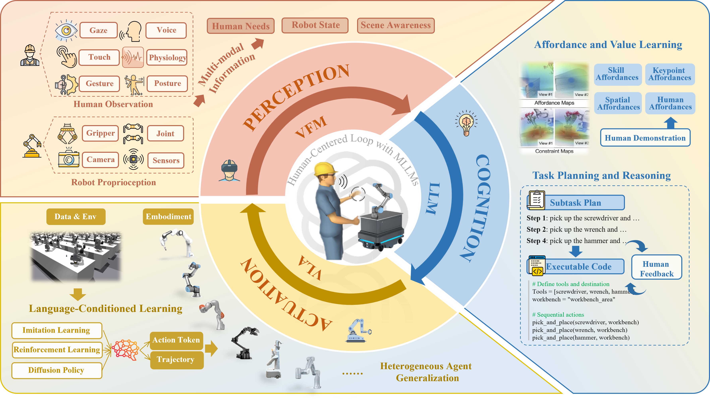

# 🚀 Empowering Natural Human-Robot Collaboration through Multimodal Language Models and Spatial Intelligence

**📌 Title**: *Empowering Natural Human-Robot Collaboration through Multimodal Language Models and Spatial Intelligence: Pathways and Perspectives*  
**🧠 Authors**: Duidi Wu, Pai Zheng, Qianyou Zhao, Shuo Zhang, Jin Qi*, Jie Hu*, Guo-Niu Zhu, Lihui Wang  
**🏫 Affiliations**: SJTU, PolyU, FDU, KTH  
**📄 [PDF](https://doi.org/10.1016/j.rcim.2025.103064)**  
**📝 Journal**: Robotics and Computer-Integrated Manufacturing [RCIM](https://www.sciencedirect.com/journal/robotics-and-computer-integrated-manufacturing)  
**📮 Contact**: [wu_duidi@sjtu.edu.cn](mailto:wu_duidi@sjtu.edu.cn)

---

## 🌟 Overview

This is the **first systematic review** that integrates:

- 🤝 Human-Robot Collaboration (HRC)  
- 🧠 Embodied Intelligence  
- 🌐 Multimodal Large Language Models (MLLMs)  
- 🗺️ Spatial Intelligence  

We explore how MLLMs + Embodiment can *empower robots to see, think, and act like humans* in open, dynamic environments — enabling seamless and proactive HRC.


---

## 🔍 Motivation

> **Why now?**  
Industry 5.0 calls for *human-centric smart manufacturing*. With the rise of MLLMs (like GPT-4V, Gemini, LLaVA), we have a unique opportunity to:
- Bridge the gap between human intent and robot execution.
- Enable spatially-aware, low-cost, multi-skill learning.
- Move beyond “cooperation” to *collaboration and coevolution*.


## ❓ Research Questions (RQs)

1. **RQ1**: How can MLLMs and embodiment improve seamless HRC?  
2. **RQ2**: How can spatial skills be trained efficiently?  
3. **RQ3**: What are the remaining challenges and future trends?

---

## 🌈 Highlights

- 📚 Over **200+ recent works** reviewed
- 🧩 Unified perspective for **HRC × Embodied AI × Spatial Intelligence**
- 🚀 Open challenges and *design pathways* for future human-centered systems

---


## 🧭 Content Roadmap

### 🔁 1. Perception–Cognition–Actuation Loop
- Visual + language + motor signals for complete situational awareness.
- From human intention recognition → task reasoning → physical execution.


#### 📊 1.1 Robots Affordance and Value Learning

| Method     | VFM                 | LLM        | VLM       | Benchmark/Data        | Tasks                                |
|------------|---------------------|------------|-----------|------------------------|---------------------------------------|
| **Skill Affordance** |
| CoPa       | Owl-ViT, SAM        | GPT-4V     | -         | VoxPoser              | Everyday manipulation tasks [📄 Paper](https://arxiv.org/html/2403.08248v1) [💻 Code](https://copa-2024.github.io/) |
| CLIPort    | Transporter         | CLIP       | -         | Ravens                | Language-conditioned tasks [📄 Paper](https://arxiv.org/abs/2109.12098) [💻 Code](https://github.com/cliport/cliport) |
| SayCan     | -                   | 540B PaLM  | -         | Everyday Robots       | Long-horizon tasks [📄 Paper](https://say-can.github.io/assets/palm_saycan.pdf) [💻 Code](https://say-can.github.io/) |
| Voltron    | ViT                 | DistilBERT | -         | Franka Kitchen        | 5 robotics applications [📄 Paper](https://www.roboticsproceedings.org/rss19/p032.pdf) [💻 Code](https://sites.google.com/view/voltron-robotics) |
| **Keypoint Affordance** |
| MOKA       | GroundedSAM         | GPT-4V     | -         | Octo, VoxPoser        | Table-top manipulation, unseen objects [📄 Paper](https://arxiv.org/html/2403.03174v2) [💻 Code](https://moka-manipulation.github.io/) |
| ReKep      | DINOv2, SAM         | GPT-4o     | -         | VoxPoser              | In-the-wild bimanual manipulation [📄 Paper](https://rekep-robot.github.io/rekep.pdf) [💻 Code](https://rekep-robot.github.io/) |
| KALIE      | CogVLM              | GPT-4V     | -         | MOKA, VoxPoser        | Diverse unseen objects [📄 Paper](https://kalie-vlm.github.io/) [💻 Code](https://kalie-vlm.github.io/) |
| **Spatial Affordance** |
| VoxPoser   | OWL-ViT, SAM        | GPT-4      | -         | RLBench               | Manipulation tasks [📄 Paper](https://arxiv.org/abs/2307.05973) [💻 Code](https://voxposer.github.io/) |
| RAM        | DINOv2 / CLIP       | GPT-4V     | -         | DROID                 | 3D contact planning [📄 Paper](https://arxiv.org/html/2407.04689v1) [💻 Code](#) |
| RoboPoint  | CLIP, ViT-L/14      | Vicuna-13B | -         | WHERE2PLACE           | Language-conditioned 3D actions [📄 Paper](#) [💻 Code](#) |
| **Human Affordance** |
| HRP        | DINO, CLIP          | -          | -         | Ego4D                 | Human-hand-object interaction [📄 Paper](#) [💻 Code](#) |
| HULC++     | -                   | GPT-3      | -         | CALVIN                | Long-horizon manipulation [📄 Paper](#) [💻 Code](#) |


#### 📊 1.2 High-level Step-by-step Task Planning and Executable Code Generation 
| Method         | VFM           | LLM/VLM               | Benchmark         | Robot          | Tasks                             |
|----------------|---------------|------------------------|-------------------|----------------|------------------------------------|
| **Subtask Planning** |
| PaLM-E         | -             | PaLM                  | Language-Table    | Everyday Robot | Visually-grounded dialogue [📄 Paper](https://arxiv.org/abs/2303.03378) [💻 Code](#) |
| Pg-vlm         | OWL-ViT       | GPT-4, PG-InstructBLIP| PHYSOBJECTS       | Franka Panda   | Table-top manipulation [📄 Paper](#) [💻 Code](#) |
| ViLA           | OWL-ViT       | Llama2-70B, GPT-4V    | Ravens            | Franka Panda   | Long-horizon planning [📄 Paper](https://arxiv.org/abs/2402.13918) [💻 Code](https://github.com/vila-group/ViLA) |
| SayCan         | ViLD          | 540B PaLM             | Everyday Robots   | Everyday Robot | Long-horizon tasks [📄 Paper](https://say-can.github.io/assets/palm_saycan.pdf) [💻 Code](https://say-can.github.io/) |
| GD             | OWL-ViT       | InstructGPT, PaLM     | Ravens, CLIPort   | Everyday Robot | Rearrangement, mobile manipulation [📄 Paper](https://arxiv.org/abs/2303.03836) [💻 Code](https://github.com/google-research/google-research/tree/master/generative_playground) |
| Text2Motion    | -             | Text-davinci-003      | TableEnv          | -              | Long-horizon manipulation [📄 Paper](https://arxiv.org/abs/2310.05225) [💻 Code](#) |
| **Code Generation** |
| Instruct2Act   | SAM           | Text-davinci-003      | VIMABench         | -              | Manipulation & reasoning [📄 Paper](https://arxiv.org/abs/2309.05463) [💻 Code](https://github.com/instruct2act/instruct2act.github.io) |
| Inner Monologue| MDETR         | InstructGPT           | Ravens, CLIPort   | UR5e, ERobot   | Mobile rearrangement [📄 Paper](https://arxiv.org/abs/2305.14108) [💻 Code](https://github.com/inner-monologue/inner-monologue) |
| CaP            | ViLD, MDETR   | GPT-3Codex            | HumanEval         | UR5e           | Table-top & mobile manipulation [📄 Paper](https://arxiv.org/abs/2210.07255) [💻 Code](https://github.com/code-as-policies/code-as-policies.github.io) |
| ProgPrompt     | ViLD          | GPT-3                 | Virtual Home      | Panda          | Household table-top tasks [📄 Paper](https://arxiv.org/abs/2302.14674) [💻 Code](https://github.com/progprompt/progprompt.github.io) |


#### 📊 1.3 Robots Learning from Demonstration
| Model         | Structure                | Problem                  | Benchmark     | Input                       | Output                        |
|---------------|--------------------------|---------------------------|---------------|-----------------------------|-------------------------------|
| SeeDo         | SAM2 + GPT-4o            | Code Generation           | CaP           | Human demo videos           | Executable code [📄 Paper](https://arxiv.org/abs/2403.07905) [💻 Code](https://github.com/PKU-Alignment/SeeDo) |
| OKAMI         | GPT-4V + SLAHMR          | Humanoid manipulation     | ORION         | Human video                 | Manipulation policy [📄 Paper](https://okami-agent.github.io/) [💻 Code](#) |
| R3M           | ResNet50 + DistilBERT    | Visual Representation     | Ego4D         | Image, proprioception       | Action vector [📄 Paper](https://arxiv.org/abs/2203.12601) [💻 Code](https://github.com/facebookresearch/r3m) |
| R+X           | DINO + Gemini            | Skill retrieval           | R3M           | RGB-D observation           | 6-DoF action [📄 Paper](#) [💻 Code](#) |
| RT-Trajectory | PaLM-E                   | Trajectory generalization | RT-1          | Drawings, videos            | Trajectory tokens [📄 Paper](https://arxiv.org/abs/2401.10072) [💻 Code](https://robotics-transformer.github.io/) |
| Gen2Act       | Gemini + VideoPoet       | Behavior cloning          | Vid2robot     | Instruction, observation    | Trajectory [📄 Paper](https://arxiv.org/abs/2402.16102) [💻 Code](https://gen2act.github.io/) |
| EgoMimic      | ACT-based                | End-to-end imitation      | ACT           | Hand pose, proprioception   | SE(3) pose prediction [📄 Paper](https://arxiv.org/abs/2402.18694) [💻 Code](#) |


#### 📊 1.4 Robots Learning from Demonstration
| Method         | Policy Type     | Input State                      | Action Output         | Core Structure         |
|----------------|------------------|----------------------------------|------------------------|-------------------------|
| PlayLMP        | GCBC             | Observation, proprioception      | 8-DoF action           | Seq2Seq CVAE [📄 Paper](https://arxiv.org/abs/2106.13288) [💻 Code](https://github.com/Stanford-ILIAD/playroom) |
| MCIL           | GCBC             | Observation + instruction        | 8-DoF action           | TransferLangLfP [📄 Paper](https://arxiv.org/abs/2211.08854) [💻 Code](https://github.com/krishnap25/mcil) |
| BC-Z           | End-to-end BC    | Image + task embedding           | 7-DoF action           | ResNet18 + FiLM + FC [📄 Paper](https://arxiv.org/abs/2107.07396) [💻 Code](https://github.com/vriesdebc/bridge-dataset) |
| Language Table | LCBC             | Language instruction             | 2D point               | LAVA [📄 Paper](https://arxiv.org/abs/2301.12907) [💻 Code](https://language-table.github.io/) |
| CALVIN         | LH-MTLC          | Multi-modal input                | Cartesian or joint     | Seq2Seq CVAE [📄 Paper](https://arxiv.org/abs/2204.01911) [💻 Code](https://github.com/mees/calvin) |
| HULC           | LCBC             | Static image + language          | 7-DoF action           | Seq2Seq CVAE [📄 Paper](https://arxiv.org/abs/2209.14852) [💻 Code](https://github.com/serena-lyro/hulc) |
| HULC++         | LCBC             | Static image + language          | 7-DoF action           | HULC + VAPO [📄 Paper](#) [💻 Code](#) |


#### 📊 1.4 Language-Enhanced Reinforcement Learning
| Method         | Policy Type     | Challenge                  | MLLM               | Role                    | Environment        |
|----------------|------------------|----------------------------|--------------------|--------------------------|---------------------|
| Di Palo        | BC               | Sparse-reward              | FLAN-T5, CLIP      | Subgoal generation       | MuJoCo              [📄 Paper](https://arxiv.org/abs/2302.02662) [💻 Code](https://github.com/filippo-dp/vision-language-planning) |
| L2R            | MJPC             | Reward optimization        | GPT-4              | Reward function design   | MuJoCo              [📄 Paper](https://arxiv.org/abs/2310.20117) [💻 Code](https://github.com/vincentclaes/gpt4-l2r) |
| VLM-RM         | DQN, SAC         | Zero-shot rewards          | CLIP               | Reward computation       | -                   [📄 Paper](https://arxiv.org/abs/2305.16960) [💻 Code](https://github.com/facts5/vlm-reward-models) |
| Song et al.    | PPO              | Self-refinement            | GPT-4              | Reward designer          | Isaac Sim           [📄 Paper](https://arxiv.org/abs/2402.12459) [💻 Code](#) |
| Eureka         | PPO              | Human-level reward         | GPT-4              | Zero-shot reward         | Isaac Gym           [📄 Paper](https://arxiv.org/abs/2310.08591) [💻 Code](https://github.com/NVIDIA/Eureka) |
| LIV            | BC               | Goal-conditioned reward    | CLIP               | Multimodal value learning| MetaWorld           [📄 Paper](https://arxiv.org/abs/2403.03898) [💻 Code](https://github.com/LIV-Policy/LIV) |

#### 📊 1.5 Language-Guided Diffusion Policies

| Model           | Structure                    | Problem                    | Input                     | Output                  | Robot         | Links                                                                                           |
|-----------------|------------------------------|-----------------------------|----------------------------|--------------------------|---------------|------------------------------------------------------------------------------------------------|
| DiffusionPolicy | DDPM                         | Action generation           | Observation, proprioception| Action sequence          | UR5, Panda    | [📄 Paper](https://arxiv.org/abs/2203.09498) [💻 Code](https://github.com/google-research/google-research/tree/master/diffusion_policy) |
| 3DDA            | CLIP + 3D Diffuser           | 3D conditional planning     | Instruction + 3D scene     | Trajectory               | Franka        | [📄 Paper](https://arxiv.org/abs/2303.17422) [💻 Code](https://github.com/ylabbe/3dda)            |
| PoCo            | Diffusion Policy             | Heterogeneous policy        | RGB, pointcloud, language  | Trajectory               | Franka        | [📄 Paper](https://arxiv.org/abs/2302.09379) [💻 Code](https://github.com/facebookresearch/poco)  |
| MDT             | CLIP + Voltron + Perceiver   | Core diffusion policy       | Observation + goal         | Action chunk             | Franka        | [📄 Paper](https://arxiv.org/abs/2303.09559) [💻 Code](https://github.com/facebookresearch/MDT)    |
| Octo            | T5-base                      | Action chunk diffusion      | Obs + instruction          | Action chunk             | 9 robots      | [📄 Paper](https://arxiv.org/abs/2303.11132) [💻 Code](https://github.com/OctoLabAI/Octo)          |
| RDT-1B          | SigLIP + T5-XXL              | Scaled policy learning      | Visuo-lingo-motor data     | Denoised action chunk    | ALOHA robot   | [📄 Paper](#) [💻 Code](#)                                                                       |


### 🧠 2. Spatial Intelligence & World Models
- *VoxPoser*, *ReKep*, *RoboFlamingo* as pathways to zero-shot 6-DoF actions.
- *GR-1*, *3D-VLA*, *RoboDreamer* for predictive world models.
- The Key Technology of Embodied Intelligence


| Category                  | Method        | VFM / LLM / VLM                      | Benchmark/Data       | Input / Tasks / Output                              | Links                                       |
|---------------------------|---------------|------------------------------------|----------------------|----------------------------------------------------|---------------------------------------------|
| **Robotic Transformers (RT)** | RT-1          | FiLM EfficientNet                  | RT-1                 | Observation and instructions; Output: 11D actions  | [📄 Paper](https://arxiv.org/abs/2304.07268) [💻 Code](https://github.com/google-research/rt1) |
|                           | RT-2          | ViT, PaLI-E, PaLI-X                | RT-1                 | Observation and instructions; Output: 7D action tokens | [📄 Paper](#) [💻 Code](#)                   |
|                           | MOO           | Owl-ViT, FiLM EfficientNet         | RT-1                 | Images and language instructions; Output: 7D action tokens | [📄 Paper](https://arxiv.org/abs/2304.07146) [💻 Code](https://github.com/stone-rl/open-world-robotics) |
|                           | Q-Transformer | FiLM EfficientNet                  | Manual dataset       | Observation and instructions; Output: Q-value of action | [📄 Paper](https://arxiv.org/abs/2303.08152) [💻 Code](#)  |
|                           | RT-H          | ViT, PaLI-X                       | Kitchen dataset      | Image and task tokens, action query; Output: Action token | [📄 Paper](https://arxiv.org/abs/2403.13402) [💻 Code](#)  |
| **Vision-Language-Action (VLA)** | Bi-VLA        | Qwen-VL                           | -                    | Observation and user request; Output: Executable code | [📄 Paper](#) [💻 Code](#)                   |
|                           | OpenVLA       | SigLIP, DinoV2, Prismatic-7B      | OXE, BridgeData V2    | Observation and instructions; Output: 7D action tokens | [📄 Paper](#) [💻 Code](#)                   |
|                           | TinyVLA       | Pythia                           | MetaWorld             | Observation and instructions; Output: 6D action       | [📄 Paper](#) [💻 Code](#)                   |
|                           | LLaRA        | GPT-4, LLaVA-1.5-7B               | VIMA, inBC, D-inBC    | Observation, task, and previous actions; Output: Textual actions | [📄 Paper](#) [💻 Code](#)                   |
|                           | RoboPoint    | CLIP, Vicuna-v1.5                 | WHERE2PLACE           | Observation and instructions; Output: 3D action points | [📄 Paper](#) [💻 Code](#)                   |
|                           | Roboflamingo | LLaMA, GPT-4, OpenFlamingo         | CALVIN                | Task and 2 camera views; Output: 7D action tokens     | [📄 Paper](https://arxiv.org/abs/2304.02532) [💻 Code](#) |
|                           | RoboUniView  | ViT, UVFormer                    | CALVIN                | Task and multi-camera views; Output: 7D action tokens | [📄 Paper](#) [💻 Code](#)                   |
|                           | RoboMamba   | CLIP, Mamba                      | LLaVA 1.5, RoboVQA    | Image and language question; Output: 6-DoF EEF poses   | [📄 Paper](#) [💻 Code](#)                   |
| **Out-of-box Usage**         | CoPa          | Owl-ViT, SAM, GPT-4V              | Real-world data       | Observation and instructions; Output: 6-DoF end-effector poses | [📄 Paper](https://arxiv.org/html/2403.08248v1) [💻 Code](https://copa-2024.github.io/) |
|                           | VoxPoser      | Owl-ViT, SAM, GPT-4              | RLBench               | Observation and instructions; Output: Sequence of 6-DoF waypoints | [📄 Paper](https://arxiv.org/abs/2309.09914) [💻 Code](#)  |
|                           | ReKep         | DINOv2, SAM, GPT-4o              | VoxPoser               | Observation and instructions; Output: Sequence of 6-DoF poses | [📄 Paper](#) [💻 Code](#)                   |
|                           | MA            | GPT-4V, Qwen-VL                  | RLBench                | Task goal and multi-views images; Output: 6-DoF EEF poses  | [📄 Paper](https://arxiv.org/abs/2403.07877) [💻 Code](#)  |
|                           | Open6DOR      | GroundedSAM, GPT-4V              | Synthetic dataset       | Observation and instructions; Output: Robot motion trajectory | [📄 Paper](#) [💻 Code](#)                   |
| **World Model**             | 3D-VLA        | Flan, T5XL, BLIP2                | OXE, RH20T             | Interaction token with 3D scene; Output: Image, pointcloud, action | [📄 Paper](#) [💻 Code](#)                   |
|                           | GR-1          | ViT, CLIP                       | RT-1, HULC, R3M, CALVIN | Instructions, video frame, robot state; Output: Images, action trajectories | [📄 Paper](https://arxiv.org/abs/2306.06414) [💻 Code](#)  |
|                           | GR-2          | VQGAN, cVAE                     | GR-1, RT-1, HULC, RoboFlamingo | Instructions, video frame, robot state; Output: Images, action trajectories | [📄 Paper](#) [💻 Code](#)                   |
|                           | RoboDreamer   | T5-XXL                         | UniPi, AVDC, RLBench    | Language and multimodal instructions; Output: Video and actions | [📄 Paper](#) [💻 Code](#)                   |
|                           | EVA           | CLIP, Vicuna-v1.5, ChatUniVi   | EVA-Bench               | Observation and instructions; Output: Videos, text responses  | [📄 Paper](#) [💻 Code](#)                   |
|                           | PIVOT-R       | CLIP, LLAVA                    | BC-Z, Gato, RT-1, Octo, GR-1 | Instructions, observation, robot state; Output: Waypoint image, EEF action | [📄 Paper](#) [💻 Code](#)                   |
|                           | DINO-WM       | DINOv2                         | Dreamerv3, AVDC         | Current and goal observation; Output: Action sequence       | [📄 Paper](#) [💻 Code](#)                   |
|                           | WHALE         | ST-transformer                 | OXE, Meta-World         | Observation and action subsequences; Output: Observation predictions | [📄 Paper](#) [💻 Code](#)                   |


### 🔬 3. From Generalist to Specialist
- RT-X, Octo, and π₀ for generalist policy scaling.
- Gear insertion, screw-driving, cooking: moving from daily-life to *manufacturing*.


### 🛠️ 4. Platforms & Benchmarks
- IsaacGym, ManiSkill, Robosuite, Genesis, and the “Digital Cousin” framework.
- Large-scale multimodal datasets (OXE, CALVIN, Ego4D, etc.)

| Name | Type | Focus Area | Key Features / Environment | Link | Key Publication |
|---|---|---|---|---|---|
| Open X-Embodiment (OpenX) | Dataset | General Manipulation | <details><summary>Details</summary>Aggregates 20+ datasets, cross-embodiment/task/environment, >1M trajectories | [Project](https://robotics-transformer-x.github.io/) | [arXiv](https://arxiv.org/abs/2310.08864) |
| DROID | Dataset | Real-world Manipulation | <details><summary>Details</summary>Large-scale human-collected data (500+ tasks, 26k hours) | [Project](https://droid-dataset.github.io/) | [arxiv](https://arxiv.org/abs/2403.06037) |
| CALVIN | Dataset / Benchmark | Long-Horizon Manipulation | <details><summary>Details</summary>Long-horizon tasks with language conditioning, Franka arm, PyBullet simulation | [Project](http://calvin.cs.uni-freiburg.de/)| [arxiv](https://arxiv.org/abs/2112.03227) |
| QUARD | Dataset | Quadruped Robot Tasks | <details><summary>Details</summary>Large-scale multi-task dataset (sim + real) for navigation and manipulation | [Project](https://sites.google.com/view/quar-vla) | [ECCV 2024](https://arxiv.org/abs/2312.14457) |
| BEHAVIOR-1K | Dataset / Benchmark | Household Activities | <details><summary>Details</summary>1000 simulated human household activities | [Project](https://behavior.stanford.edu/) | [arxiv](https://arxiv.org/abs/2108.03332) |
| Isaac Sim / Orbit / OmniGibson | Simulator | High-fidelity Robot Simulation | <details><summary>Details</summary>NVIDIA Omniverse-based, physically realistic | [Isaac-sim](https://developer.nvidia.com/isaac-sim), [Orbit](https://isaac-orbit.github.io/), [OmniGibson](https://omnigibson.stanford.edu/) | - |
| Habitat Sim | Simulator | Embodied AI Navigation | <details><summary>Details</summary>Flexible, high-performance 3D simulator | [Project](https://aihabitat.org/) | [arxiv](https://arxiv.org/abs/1904.01201) |
| MuJoCo | Simulator | Physics Engine | <details><summary>Details</summary>Popular physics engine for robotics and RL | [Website](https://mujoco.org/) | - |
| PyBullet | Simulator | Physics Engine | <details><summary>Details</summary>Open-source physics engine, used for CALVIN, etc. | [Website](https://pybullet.org/) | - |
| ManiSkill (1, 2, 3) | Benchmark | Generalizable Manipulation Skills | <details><summary>Details</summary>Large-scale manipulation benchmark based on SAPIEN | [Project](https://maniskill.ai/) | [arxiv](https://arxiv.org/abs/2107.14483) |
| Meta-World | Benchmark | Multi-task / Meta RL Manipulation | <details><summary>Details</summary>50 Sawyer arm manipulation tasks, MuJoCo | [Project](https://meta-world.github.io/)| [arxiv](https://arxiv.org/abs/1910.10897) |
| RLBench | Benchmark | Robot Learning Manipulation | <details><summary>Details</summary>100+ manipulation tasks, CoppeliaSim (V-REP) | [Project](https://sites.google.com/view/rlbench) | [arxiv](https://arxiv.org/abs/1909.12271) |
| VLN-CE / R2R / RxR | Benchmark | Vision-Language Nav | <details><summary>Details</summary>Standard VLN benchmarks, often run in Habitat | [VLN-CE](https://github.com/jacobkrantz/VLN-CE),[R2R-EnvDrop](https://github.com/airsplay/R2R-EnvDrop),[RxR](https://github.com/google-research-datasets/RxR) | - 


---
## 🧩 Citation

If you find this work helpful, please consider citing:

```bibtex
@article{wu2025empowering,
  title={Empowering Natural Human-Robot Collaboration through Multimodal Language Models and Spatial Intelligence: Pathways and Perspectives},
  author={Wu, Duidi and Zheng, Pai and Zhao, Qianyou and Zhang, Shuo and Qi, Jin and Hu, Jie and Zhu, Guo-Niu and Wang, Lihui},
  journal={Preprint},
  year={2025}
}
